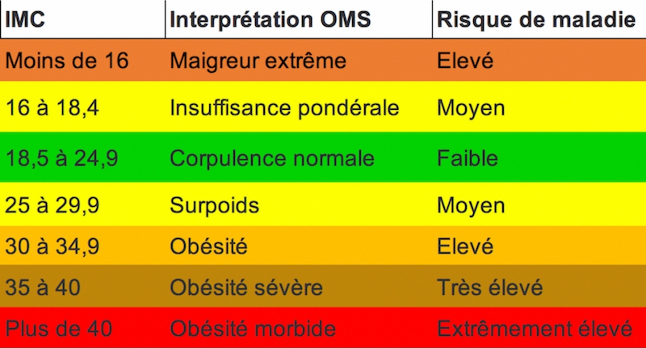

# JavaScript - Manger 5 fruits et légumes par jour ;) !
> Le TP doit respecter les normes et les standards du WEB (ex. https://www.w3.org/ et https://checklists.opquast.com/fr/)

## Mise en situation
Les conditions en JS n'ont plus de secrets pour vous, nous allons vérifier cela :)  
Votre mission, mettre en place un site nous permettant de connaître son IMC : Indice de Masse Corporelle.

Nous allons nous baser sur le site pour les calculs et les conseils :
https://quentin-pakiry.fr/calcul-imc-homme

## Structure du site
Le dossier de ce test sera composé de cette manière :
* index.html
* assets
    * img
        * images_du_site
    * css
        * style.css
    * script
        * script.js

## Contraintes de structure du site
* Une feuille de style obligatoire si vous souhaitez faire du CSS ( *style.css* ) : **Pas de balise ou attribut style** dans votre page html.
* Les images, si besoin, se trouveront dans le dossier **assets/img**.
* Utilisation de l'anglais lors de la création de vos **class, variable, etc...**.
* Un code **propre** avec une belle **indentation** pour plus de lisibilité.

## Fonctionnalités du site
* Recupérer à l'aide de la fonction ***window.prompt()*** la taille et le poids de l'utilisateur.
* Une fois le calcul effectué, informer des résultats à l'aide de la fonction ***window.alert()*** :
    * IMC
    * Interprétation OMS
    * Risque de maladie
* Présence d'un **bouton** permettant de **reload** la page (ex. mettre en place un href vers la même page) et qui relancera le script, et donc le calcul de l'IMC.

*Exemple du tableau à prendre en compte*
  

## Pièges à éviter
* Avertir l'utilisateur qu'il ne peut pas entrer que des chiffres (ex. de fonctions utiles : isNaN(), Number(), ...)
* Attention au opération impossible : *ex. une division par zéro*
## A VOUS DE CODER !!
> Ne pas avoir peur de son IMC, ce n'est qu'un chiffre :D
